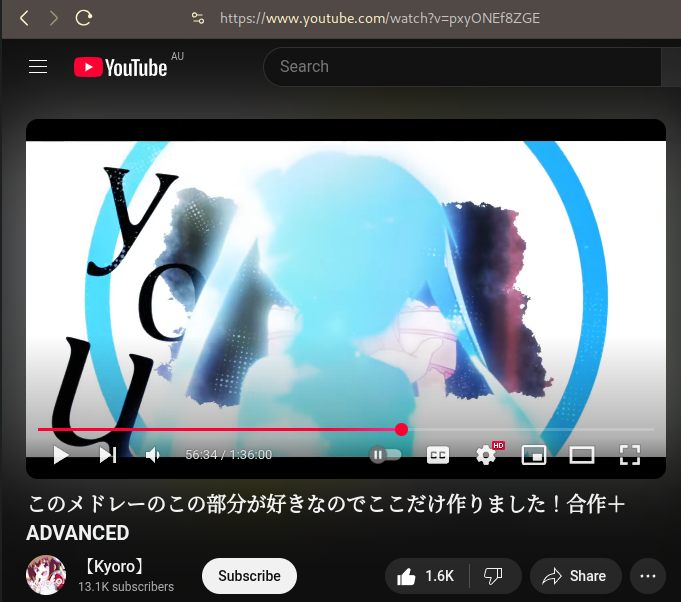
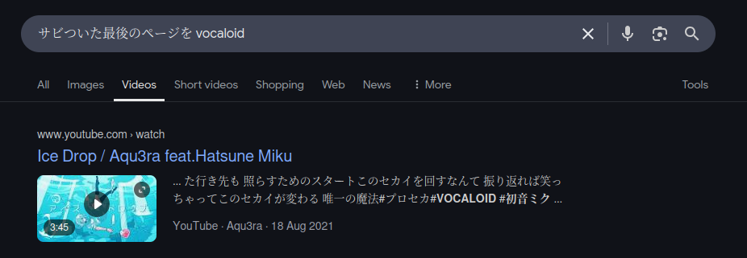
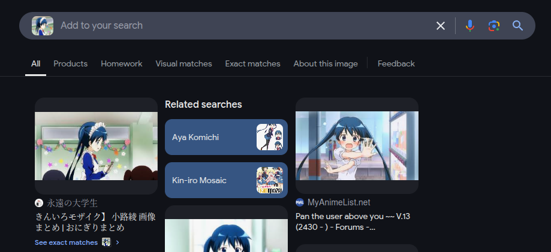

**Category**: OSINT\
**Solves**: ~20/553\
**Value**: 412/500\
**Note**: Blooded in under 3 hours (My very first :D)

---
> I saved this screenshot of a video I liked, but I can't remember what it was! (image.png). All I remember is that the video was a collaboration (合作) and that it was uploaded sometime last September. Can you find the following information about the image?
> 
> 1. the YouTube video id of the collaboration (`v=???`)
> 2. the audio source (english song title, all lowercase)
> 3. the visual source (romanized name of the character in the image, all lowercase, given name then surname)
> 4. the YouTube channel of the author of the part shown in the image (`@???`, note that this is not the channel that uploaded the full video!)
>  
> Flag format: `texsaw{1,2,3,4}`
> If the image was example.png, then the flag would be: `texsaw{dQw4w9WgXcQ,never gonna give you up,rick astley,RickAstleyYT}`
>
> example.png
> 
> 
> image.png 
> 

## Finding the Video
From the challenge description and image, it was clear that I have to find the original video to progress further. Many noteworthy hints were provided that I immediately took notice:
- An emphasis seems to be placed on the Japanese word `合作` for collaboration.
- The video was uploaded last September (which was 2024) on YouTube.
- A live chat replay is shown in the image, with usernames and corresponding chat messages. This indicates the video was either a livestream or premiere.

The naive approach would be to reverse image search and/or translating the chat, but these will not provide any valuable information. However, the video could easily be found based off of the aforementioned hints by entering into the YouTube search bar: `合作 before:2024-10-01 after:2024-08-31`. This would show videos with the keyword `合作` posted in September 2024. From here, I just need to find the following [video](https://www.youtube.com/watch?v=-c6fmouqPUI) with a live chat replay - this part is quite random due to YouTube algorithm. Although it was the third result when I first perform the search, it was a little harder to find from further testing in a fresh browser without signing in.\
\
Here, I confirmed right away that this was potentially the correct video by looking at the live chat. There are many familiar names with the same profile picture from `image.png` such as `doctor`, `無糖`, `No25.にゃ介` (these may change in the future though). In the description, there is another [video](https://www.youtube.com/watch?v=pxyONEf8ZGE) published in September 2024 with a similar compilation format and many same live chatters, but titled "ADVANCED" instead. Both videos seem to contain a link to each other, and both are attached with the same Google sheets link (keep note of this).\

## Timestamp Search
Based on the current information, it is uncertain which video is the correct one since they both fit the given criterion. The videos' combined length is about 2 hours and 56 minutes long, so manually scanning to find the exact frame is very impractical. However, there are two useful tools that can help us easily and consistently locate it: [OCR](https://en.wikipedia.org/wiki/Optical_character_recognition) (I used [OnlineOCR](https://www.onlineocr.net/)) and [chat-downloader](https://github.com/xenova/chat-downloader). 
- Take a screenshot of a short to medium-length chat message in `image.png`. Upload it onto OnlineOCR, select `JAPANESE` and convert.
- Copy the message in the text box - you do not need to download the output file.
- Install chat-downloader and apply the tool on both videos (the gibberish text is the video id) - the exact timestamp of the chat message is found in the "ADVANCED" video.

\
\
Now, I just need to scan roughly around that timestamp and easily find the source of `image.png`. The **first part** of the flag is confirmed to be `pxyONEf8ZGE`. From here, finding the remaining parts becomes much easier.\

## Piecing Together the Flag
From watching the video, I instantly notice that the text on screen are the lyrics of the song - clues towards the second part of the flag. Here, I just need to find a section of the song where the lyrics is not heavily edited and apply OCR on it (I included the entire video frame as a reference, but OnlineOCR work best if you provide an image with *only* the text).

By looking up the lyrics `サビついた最後のページを` on Google and switch to "Videos" tab, the original music video could be found either on [YouTube](https://www.youtube.com/watch?v=WXvm5XfkXrk) or [Niconico](https://www.nicovideo.jp/watch/sm39202842) after a bit of digging. If the title is in Japanese, just putting it into Google Translate would translate it to `ice drop` - this is the **second part** of the flag. During the competition, I used the query `サビついた最後のページを vocaloid` which gave the right video as the first result.\
\
The **third part** of the flag was much easier - just find a frame where the twintail girl is clearly visible and [reverse image search](https://images.google.com/). This reveals her name to be `aya komichi` (AYAYA reference!) \
\
Remember the [Google sheet](https://docs.google.com/spreadsheets/d/1p58XfZqNvvuzFX9XelQlE3fcvYq9dwLglwJz9MKwxq8/edit?gid=253941028#gid=253941028)? Upon inspection, I noticed the first column has the header "BPM" and corresponding 3-digit numbers. This refers to "beats per minute", which simply put is a measurement for tempo in music. I intuitively understand that this sheet may be documenting details about the collaboration video. By translating the other three headers: `メドレー`, `曲名`, `担当者` corresponds to "Medley", "Song Name" and "Person in Charge". \
\
This means the **fourth part** of the flag could be found by taking the Japanese title of the song `アイスドロップ` and search for it by pressing Ctrl+F. This reveals `ねそ` to be the author of the part shown in the image (not to be confused with the artist behind "Ice Drop"). Looking this name up on YouTube revealed their username to be `ねそ-l9b`.\

Putting everything together, we get the flag `texsaw{pxyONEf8ZGE,ice drop,aya komichi,ねそ-l9b}`.

## Skills Learned
- YouTube search technique: Using search operators (`before:`, `after:`, keyword filtering).
- Utilization of OCR for text extraction from images.
- Using `chat-downloader` tool for livestreams and videos chat scraping.
- Contextual problem-solving and attention to details.
